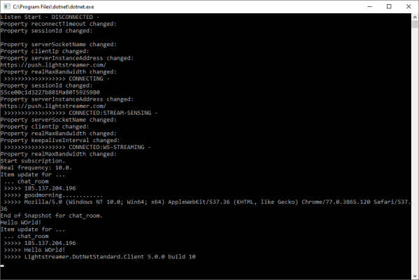

# Lightstreamer - Quickstart Example - .NET Client #
<!-- START DESCRIPTION lightstreamer-example-quickstart-client-dotnet -->
The *Quickstart Example* provides the source code to build very simple and basic client applications, used to test the capability of the Client APIs to connect and receive data from Lightstreamer Server. The examples can be used to familiarize with the Client APIs and as a reference on how to use them, and can be used as a starting point for client application implementations.

This project contains the C# source files of a sample application, that shows how the [Lightstreamer .NET Client API](http://www.lightstreamer.com/docs/client_dotnet_api/frames.html) can be used to connect to Lightstreamer Server.
<!-- END DESCRIPTION lightstreamer-example-quickstart-client-dotnet -->

## Details

The `TestClient.cs` file contains the source Main(). It basically connects to the server and perform a subscription, printing on the console the incoming Item Updates.

The test includes the necessary code and a sample configuration file for Library logging through [Log4Net](http://logging.apache.org/log4net/index.html).

## Build

To build and install a version of this demo, pointing to your local Lightstreamer Server instance, follow the steps below.

* The *Quickstart Example*, needs both the *PORTFOLIO_ADAPTER* ( see the [Lightstreamer - Portfolio Demo - Java Adapter](https://github.com/Weswit/Lightstreamer-example-Portfolio-adapter-java)), and the *QUOTE_ADAPTER* (see the [Lightstreamer - Stock-List Demo - Java Adapter](https://github.com/Weswit/Lightstreamer-example-StockList-adapter-java)). Therefore, as a prerequisite, the full version of the [Lightstreamer - Portfolio Demo - Java Adapter](https://github.com/Weswit/Lightstreamer-example-Portfolio-adapter-java) has to be deployed on your local Lightstreamer Server instance. Please follow the instruction in [Install the Portfolio Demo](https://github.com/Weswit/Lightstreamer-example-Portfolio-adapter-java#install-the-portfolio-demo) to install it.
* Get the `DotNetClient_N2.dll` and `DotNetClient_N2.pdb` files from the `DOCS-SDKs/sdk_adapter_dotnet/lib` folder of the [latest Lightstreamer distribution](http://www.lightstreamer.com/download), and copy them into the `lib` directory of the project.
* Get the `Log4Net.dll`, from [http://logging.apache.org/log4net/download_log4net.cgi](http://logging.apache.org/log4net/download_log4net.cgi), and copy it into the `lib` directory of the project.
* Create a project for a Console Application target, 
* include the source files,
* include the references to the `DotNetClient_N2.dll`, `DotNetClient_N2.pdb` and `Log4Net.dll`files in the `lib` folder
* Run the demo. The host name and the port number of the Lightstreamer server have to be passed to the application as command line arguments.

*Please, refer to the instructions included in the source file for more details on how to configure and run the test.*

## See Also

### Lightstreamer Adapters Needed by These Clients 
<!-- START RELATED_ENTRIES -->

* [Lightstreamer - Stock-List Demo - Java Adapter](https://github.com/Weswit/Lightstreamer-example-Stocklist-adapter-java)
* [Lightstreamer - Portfolio Demo - Java Adapter](https://github.com/Weswit/Lightstreamer-example-Portfolio-adapter-java)
* [Lightstreamer - Reusable Metadata Adapters - Java Adapter](https://github.com/Weswit/Lightstreamer-example-ReusableMetadata-adapter-java)

<!-- END RELATED_ENTRIES -->
### Related Projects 

* [Lightstreamer - Basic Stock-List Demo - .NET Client](https://github.com/Weswit/Lightstreamer-example-StockList-client-dotnet)

## Lightstreamer Compatibility Notes

- Compatible with Lightstreamer .NET Client Library version 2.1 or newer.
- For Lightstreamer Allegro (+ .NET Client API support), Presto, Vivace.

